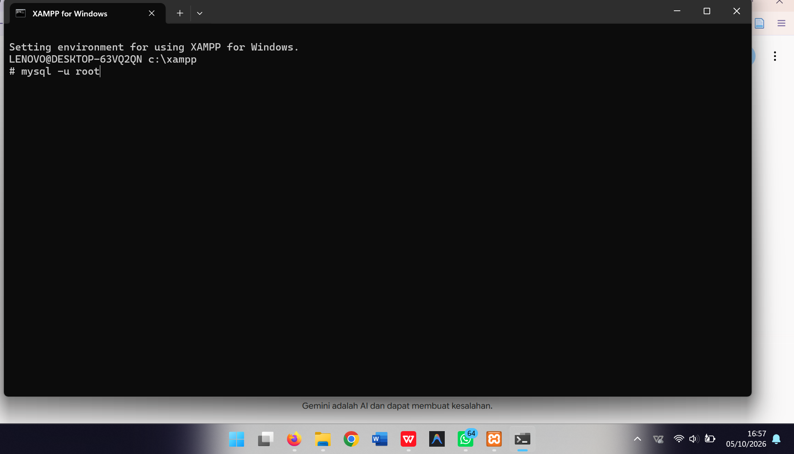
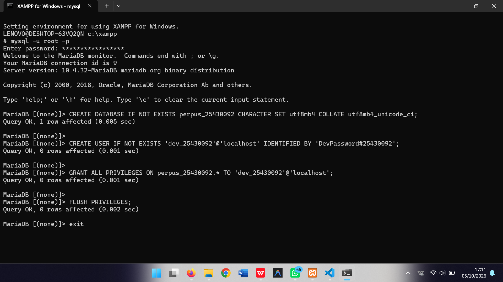
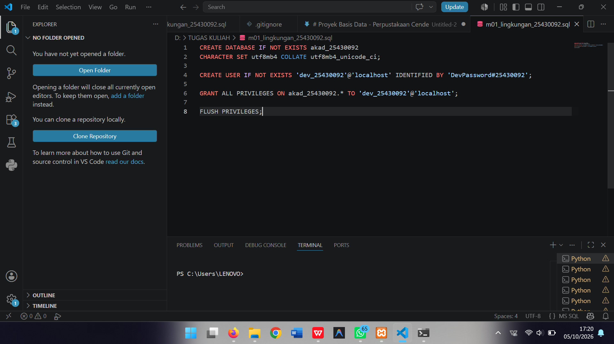
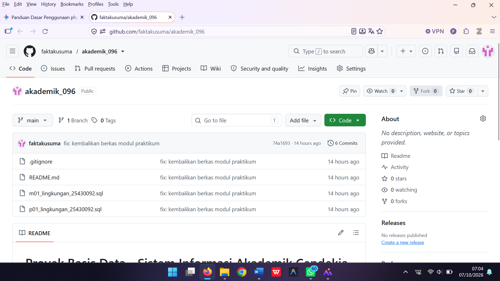

# LAPORAN PRAKTIKUM BASIS DATA

**Modul:** 01 - Pengenalan Lingkungan Basis Data  
**Nama:** M. Fakta Kusuma  
**NIM:** 25430092  
**Kelas:** D  

---

## A. TUJUAN PRAKTIKUM
1. Memahami konsep dasar dan arsitektur Sistem Manajemen Basis Data (DBMS) MySQL/MariaDB.
2. Menguasai perintah dasar SQL (Data Definition Language & Data Control Language) untuk membuat basis data, pengguna (user), serta pemberian hak akses (*privileges*).
3. Mampu mengelola dan menyusun skrip SQL menggunakan Code Editor (Visual Studio Code).
4. Menguasai alur kerja kontrol versi (*version control system*) menggunakan Git dan GitHub untuk mengorganisir berkas praktikum secara rapi.

---

## B. DASAR TEORI
Basis Data adalah kumpulan data terstruktur yang dikelola secara elektronik untuk memudahkan penyimpanan, manipulasi, dan pengambilan informasi. SQL (*Structured Query Language*) digunakan sebagai bahasa standar interaksi basis data relasional. 

Dalam pengelolaan lingkungan praktikum basis data modern, aspek keamanan (seperti pengelolaan akun pengguna dan privilese) serta penyusunan kode sumber menggunakan Git/GitHub sangat krusial agar seluruh artefak proyek terarsip dengan aman dan teratur.

---

## C. LANGKAH-LANGKAH PRAKTIKUM

### 1. Pengaksesan dan Konfigurasi DBMS via Command Line (CLI)
- Menjalankan lingkungan XAMPP dan masuk ke dalam MariaDB Monitor menggunakan akun root.
- Mengubah kredensial root dan melakukan pembaruan hak akses (*FLUSH PRIVILEGES*).
- Membuat basis data baru serta pengguna khusus praktikum beserta privilese penuh (*GRANT ALL PRIVILEGES*).

### 2. Penulisan Skrip SQL pada VS Code
- Menyusun skrip SQL modul praktikum (`m01_lingkungan_25430092.sql` dan `p01_lingkungan_25430092.sql`) untuk pembuatan database akademis dan perpustakaan.

### 3. Pengelolaan Repositori Git & `.gitignore`
- Menginisialisasi repositori Git lokal pada folder kerja `D:\TUGAS KULIAH`.
- Menyusun aturan `.gitignore` untuk mengabaikan berkas non-esensial dan kredensial sensitif.
- Melakukan sinkronisasi remote repository ke GitHub (`akademik_096`).

---

## D. HASIL DAN PEMBAHASAN

### 1. Masuk ke Lingkungan MariaDB
Akses ke MariaDB CLI dilakukan menggunakan perintah `mysql -u root` melalui shell XAMPP.

### 2. Eksekusi Skrip SQL Pembuatan Database & User
Pembuatan database `kopma_25430092` dan `perpus_25430092` beserta akun pengguna terkait berhasil dieksekusi tanpa kendala melalui perintah CLI.

### 3. Struktur Skrip SQL pada VS Code
Seluruh perintah DDL dan DCL dikompilasi ke dalam berkas `.sql` agar dapat dikelola dan dieksekusi secara terstruktur melalui editor VS Code.

### 4. Konfigurasi `.gitignore`
Untuk menjamin keamanan kredensial dan kebersihan repositori, aturan penyaringan berkas ditambahkan pada `.gitignore`.

### 5. Sinkronisasi ke GitHub
Pengunggahan berkas dari repositori lokal ke GitHub remote dilakukan dengan perintah `git push origin main`.

---

## E. KESIMPULAN
Praktikum Modul 1 telah berhasil dilaksanakan. Lingkungan kerja MariaDB/MySQL telah terkonfigurasi dengan baik, skrip DDL/DCL telah dibuat dan diuji, serta repositori GitHub `akademik_096` telah disinkronkan secara rapi tanpa menyertakan berkas non-esensial.