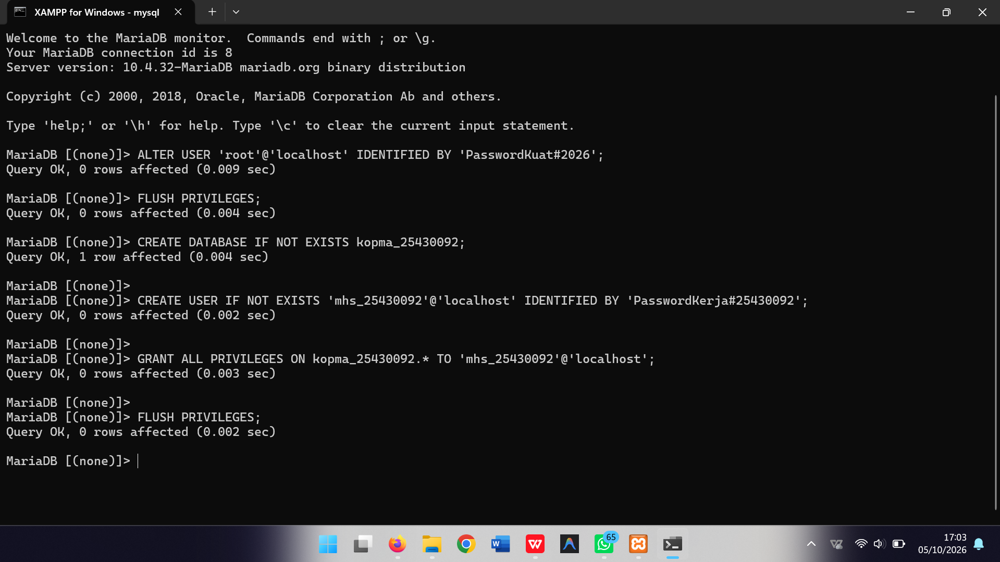
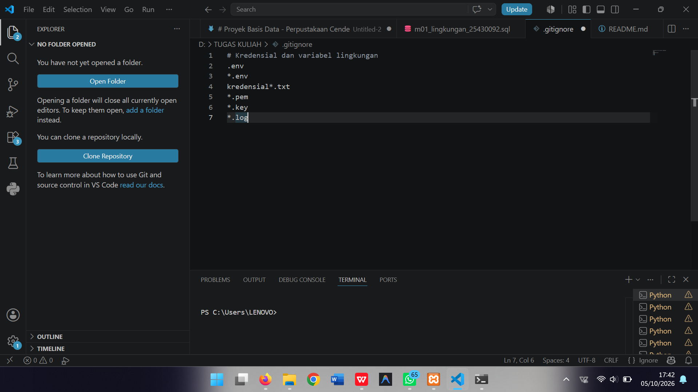
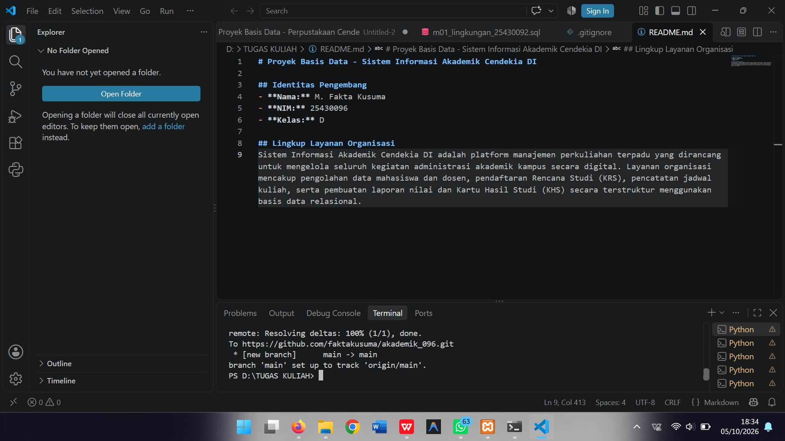

# Laporan Praktikum Basis Data - Pertemuan 1

**Nama:** M.Fakta Kusuma  
**NIM:** 5430092  
**Kelas:** D  
**Pertemuan:** 1  
**Tanggal:** 7/10/26  
**Dosen/Asisten:** Dedi Irawan, S.Kom., M.T.I.  

---

## 1. Capaian Praktikum
* Memahami mekanisme pengoperasian *service* MariaDB lewat kontrol panel XAMPP.
* Mengintegrasikan koneksi server melalui terminal CLI dan *interface* phpMyAdmin.
* Mengatur keamanan akun administratif (`root`) serta mengonfigurasi user baru dengan batasan hak akses minimum.
* Mempraktikkan alur pencatatan dan sinkronisasi berkas pekerjaan menggunakan Git ke repositori GitHub.

## 2. Landasan Teori
Database Management System (DBMS) adalah merupakan system perangkat lunak utama yang berfungsi memproses,menyimpan ,dan menjamin keamanan data secara teratur dan terstrukur. MariaDB beroperasi dengan arsitektur *client-server*, di mana *service* `mysqld bekerja di balik layer menerima intruksi kueri pada port 3306

## 3. Hasil Langkah Percobaan

### a. Verifikasi Versi Server & Pengguna Aktif
  
*Keterangan: Eksekusi perintah `SELECT VERSION(), CURRENT_USER();` di terminal MariaDB untuk mengecek hasil versi engine dan akun yang terhubung.*

### b. Pemeriksaan Mode SQL Server
  
*Keterangan: Pengecekan parameter `SELECT @@sql_mode;` untuk memastikan aturan `STRICT_TRANS_TABLES` telah aktif.*

### c. Akses Akun Kerja mhs_092
  
*Keterangan: Hasil eksekusi `SHOW DATABASES;` menggunakan user `mhs_092` yang membatasi hak akses hanya pada basis data miliknya dan `information_schema`.*

### d. Bukti Galat 1044 & 1142
  
*Keterangan: Munculnya `ERROR 1044 (42000)` saat user `mhs_092` mencoba mengakses basis data sistem `mysql`.*

  
*Keterangan: Penolakan akses `ERROR 1142 (42000)` saat akun tidak memiliki wewenang eksekusi pada tabel tertentu.*

### e. Tampilan Masuk phpMyAdmin Mode Cookie
  
*Keterangan: Antarmuka login phpMyAdmin setelah konfigurasi autentikasi pada `config.inc.php` diganti ke opsi `cookie`.*

## 4. Jawaban Titik Analisis

* **Titik Analisis 1 (Relasi MariaDB dan MySQL):**  
Meskipun pada kontrol panel XAMPP tertulis "MySQL", mesin relasional yang sebenarnya beroperasi adalah MariaDB. Dokumentasi MySQL tetap relevan untuk instruksi ANSI SQL dasar. Namun, untuk arsitektur internal, variabel sistem, mesin penyimpanan, dan mekanisme keamanan, dokumen resmi MariaDB harus menjadi acuan utama.

* **Titik Analisis 2 (Anatomi Pesan Penolakan Akses):**  
Saat menjalankan perintah `mysql -u root` tanpa menyertakan `-p` pada akun root yang berpassword, server menolak akses dengan respons `ERROR 1045 (28000): Access denied for user 'root'@'localhost' (using password: NO)`. Tanda bahwa klien tidak mengirim kata sandi berada pada klausa `(using password: NO)`.

* **Titik Analisis 3 (Skema Metadata vs Sistem & Rincian Kode Galat):**  
`information_schema` dapat diakses oleh semua user karena hanya memuat metadata sistem yang bersifat *read-only*. Sementara itu, basis data `mysql` dibatasi ketat karena menyimpan tabel autentikasi dan wewenang global server.  
  * **ERROR 1044:** Terjadi akibat akun gagal berpindah ke database tertentu karena ketiadaan hak akses skema.  
  * **ERROR 1045:** Terjadi pada fase awal koneksi akibat kesalahan kombinasi *username*, *password*, atau *host*.  
  * **ERROR 1142:** Terjadi saat koneksi berhasil tetapi perintah spesifik (seperti `SELECT` atau `CREATE`) dilarang pada tabel sasaran.

* **Titik Analisis 4 (Keunggulan Autentikasi Cookie):**  
Sistem autentikasi `cookie` lebih aman daripada mode `config` karena kredensial masuk dienkripsi pada peramban dan tidak disimpan dalam teks polos pada berkas server lokal.

## 5. Hasil Latihan dan Modifikasi
Dokumentasi hasil pengerjaan Latihan E dan verifikasi akun:
1. 

## 6. Tugas Mandiri: Milestone Proyek 1
Inisialisasi basis data dan user khusus proyek pribadi:
* Nama basis data proyek: `akad_092`
* Akun pengembang proyek: `dev_092`
* Bukti bahwa `dev_092` dapat mengelola basis data proyeknya dan terisolasi dari basis data lain:  

## 7. Kesimpulan
Konfigurasi dasar server MariaDB berhasil dilakukan melalui CLI maupun phpMyAdmin. Penerapan akun dengan hak akses terbatas serta pengaturan mode `cookie` terbukti meningkatkan keamanan server secara efektif. Penggunaan Git dan GitHub memfasilitasi manajemen riwayat perubahan berkas secara rapi.

## 8. Pernyataan Penggunaan AI
Dalam penyusunan laporan ini, kecerdasan buatan (AI) digunakan sebatas alat bantu untuk:
1. memeriksa tata bahasa dan struktur penulisan.
2. membantu memahami komsep teori basis data.

Seluruh proses eksekusi perintah SQL, konfigurasi lingkungan kerja XAMPP/phpMyAdmin, pengujian di terminal, serta pengambilan tangkapan layar dilakukan secara mandiri oleh penulis.

## 9. Catatan & Bukti Sinkronisasi Git
* **URL Repositori Remote:** https://github.com/faktakusuma/akademik_096.git
* **Kode Hash Commit:** f347e4d
* **Keterangan Commit:** `fix: menambahkan tautan gambar laporan`

---

## Lembar Verifikasi Kelengkapan (Checklist)
- [x] File script `p01_lingkungan_5430092.sql` sudah tersedia
- [x] Dokumen penjelasan proyek `README.md`
- [x] Pengaturan pengabaian berkas `.gitignore`
- [x] Screenshot eksekusi `SELECT VERSION(), CURRENT_USER();`
- [x] Screenshot pemeriksaan variabel `SELECT @@sql_mode;`
- [x] Screenshot hasil `SHOW DATABASES` pada akun `mhs_092` serta `dev_092`
- [x] Screenshot penanganan pesan galat (Error 1044 & 1142)
- [x] Screenshot antarmuka phpMyAdmin berbasis autentikasi cookie
- [x] Screenshot keberhasilan perintah `git push` ke GitHub
- [x] Penjelasan Titik Analisis (Nomor 1 sampai 4) terisi lengkap
- [x] Uraian komparasi penyebab kode galat 1044, 1045, dan 1142